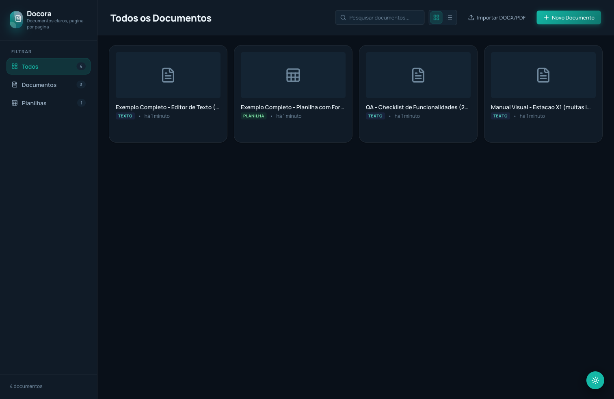
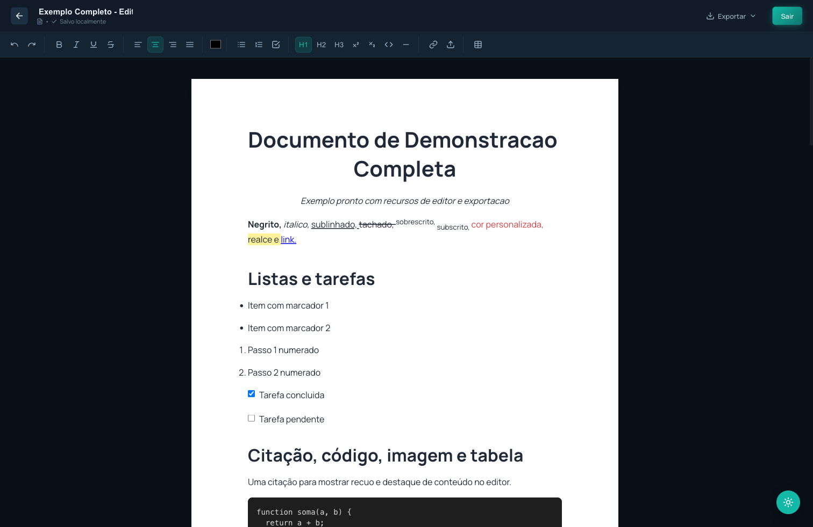
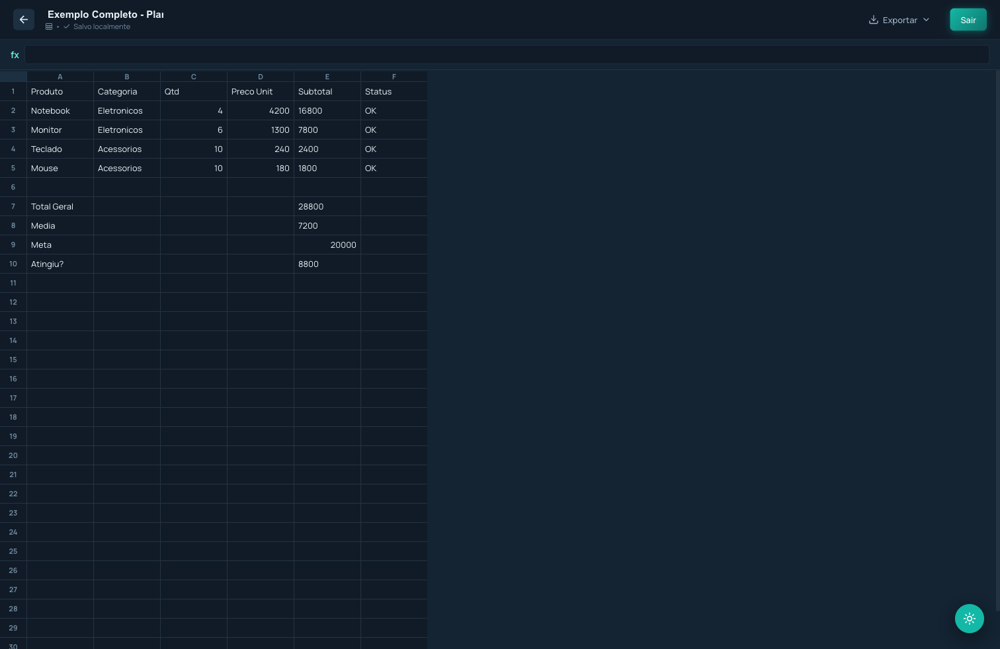

# Docora Studio

Editor de documentos e planilhas com foco em paginação A4, exportação fiel (DOCX/PDF/XLSX), importação de arquivos e persistência local.

## Visão Geral

Docora Studio foi construído para simular fluxo de editor de escritório na web:

- Criação, edição, duplicação e exclusão de documentos.
- Editor de texto rico com paginação por folhas A4.
- Editor de planilha com fórmulas básicas.
- Exportação para `DOCX`, `PDF` e `XLSX`.
- Importação de `DOCX` e `PDF`.
- Persistência em `localStorage`.
- Tema claro/escuro e interface responsiva.

## Stack

- `React 18` + `Vite 7` + `TypeScript`
- `TanStack Router`
- `Zustand` (estado global)
- `Tiptap` (editor de texto)
- `docx`, `jspdf`, `html2canvas`, `xlsx`, `mammoth`, `pdfjs-dist`
- CSS Modules + tokens de tema em `src/config/theme.ts`

## Capturas de Tela

### Dashboard



### Editor de Texto com Páginas A4



### Editor de Planilha



## Estrutura de Pastas

```text
src/
  components/      # Componentes de UI e editor
  config/          # Branding e tokens de tema
  features/        # Regras de domínio puras
  lib/             # Infra/adapters (storage, export, import, paginação)
  pages/           # Páginas do router
  services/        # Casos de uso da aplicação
  store/           # Estado global (Zustand)
  styles/          # CSS global e módulos de páginas
  types/           # Tipos compartilhados
tests/             # Testes automatizados
```

## Como Executar

### Pré-requisitos

- `Node.js >= 20`
- `npm >= 10`

### Instalação

```bash
npm install
```

### Ambiente de desenvolvimento

```bash
npm run dev
```

Abra `http://localhost:5173`.

## Qualidade e Testes

### Typecheck

```bash
npm run typecheck
```

### Testes

```bash
npm run test
```

### Cobertura 100%

```bash
npm run test:coverage
```

A suíte está configurada com `c8 --100`, exigindo 100% de cobertura para os arquivos `src/**/*.ts`.

### Build de produção

```bash
npm run build
```

## Segurança

Checklist aplicado neste projeto:

- Sem uso de `eval`, `new Function`, `innerHTML` ou `dangerouslySetInnerHTML`.
- Exportações e importações encapsuladas em serviços dedicados.
- Armazenamento local com parser e normalização de conteúdo.
- Tipagem forte nas camadas de domínio e serviço.

Recomendado antes de publicar:

- Rodar `npm audit` em ambiente com internet.
- Definir política de CSP no host de produção.
- Integrar scanner SAST/Dependabot no CI.

## Documentação Técnica

- Arquitetura detalhada: `docs/ARCHITECTURE.md`

## Scripts

- `npm run dev`: inicia servidor de desenvolvimento
- `npm run build`: gera build de produção
- `npm run start`: preview local da build
- `npm run typecheck`: validação de tipos
- `npm run test`: testes automatizados
- `npm run test:coverage`: testes com cobertura 100%

## Licença

Uso interno / privado (`private: true` no `package.json`).
